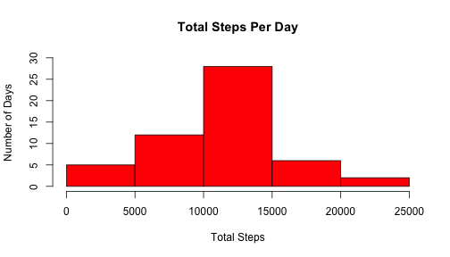
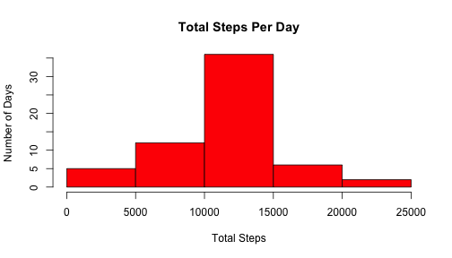

Reproducible Research - Peer Assessment 1
========================================================

### Loading and preprocessing the data

Read activity data from file. [Zip file](https://d396qusza40orc.cloudfront.net/repdata%2Fdata%2Factivity.zip) was downloaded from course repository on 18 Jul 2014.


```r
old<-read.csv("activity.csv",header=T)
```

Transform date fields for analysis. 


```r
time<-sprintf("%04d",as.numeric(as.character(old$interval)))
old$dttm<-strptime(paste(old$date,time),format="%Y-%m-%d %H%M")
```


### What is mean total number of steps taken per day?

Make a histogram of the total number of steps taken each day.


```r
oldSteps<-tapply(old$steps,old$date,sum)
hist(oldSteps,main="Steps Per Day",ylab="Days",xlab="Steps")
```

 

Calculate the mean and median total number of steps taken per day.

```r
oldMean<-mean(oldSteps,na.rm=T);oldMean
```

```
## [1] 10766
```

```r
oldMedian<-median(oldSteps,na.rm=T);oldMedian
```

```
## [1] 10765
```


### What is the average daily activity pattern?

Make time series plot of the 5-minute interval (x-axis) and the average number of steps taken, averaged across all days (y-axis).


```r
oldAvg<-tapply(old$steps,old$interval,mean,na.rm=T)
plot(oldAvg,type="l",main="Average Daily Activity",
     xlab="5-minute interval",ylab="Average steps")
```

 

Find 5-minute interval, on average across all the days, that contains the maximum number of steps.


```r
oldAvg<-as.matrix(cbind(time[1:288],oldAvg),stringsAsFactors=FALSE)
max<-max(as.numeric(oldAvg[,2]))
peak<-oldAvg[oldAvg[,2]==max,1]
t<-strptime(peak,"%H%M")
format(t,"%H:%M")
```

```
## [1] "08:35"
```


### Imputing missing values

Calculate the total number of rows with NAs.


```r
comp<-complete.cases(old[,1:3])
nrow(old)-sum(comp)
```

```
## [1] 2304
```

Devise a strategy for filling in all of the missing values in the dataset: *When NAs occur, I retrieve the rounded average number of steps for the corresponding time interval across all days in the training data set.*

Create a new dataset equal to the original dataset but with the NAs filled in.


```r
new<-old
for(i in 1:dim(old)[1]){
     if(is.na(old$steps[i])){
          new$steps[i]<-as.integer(oldAvg[as.integer(oldAvg[,1])==old$interval[i],2])
     }
}
```

Make a histogram of the total number of steps taken each day.  Do these values differ from the estimates from the first part of the assignment? What is the impact of imputing missing data on the estimates of the total daily number of steps?


```r
newSteps<-tapply(new$steps,new$date,sum)
hist(newSteps,main="Steps Per Day",ylab="Days",xlab="Steps")
```

 

Calculatethe mean and median total number of steps taken per day.


```r
newMean<-mean(newSteps,na.rm=T);newMean
```

```
## [1] 10750
```

```r
newMedian<-median(newSteps,na.rm=T);newMedian
```

```
## [1] 10641
```

Do these values differ from the estimates from the first part of the assignment? What is the impact of imputing missing data on the estimates of the total daily number of steps? 


```r
newMean-oldMean
```

```
## [1] -16.42
```

```r
newMedian-oldMedian
```

```
## [1] -124
```


### Are there differences in activity patterns between weekdays and weekends?

Create a new factor variable in the dataset with two levels -- "weekday" and "weekend" indicating whether a given date is a weekday or weekend day.

```r
new$day<-weekdays(new$dttm)
new$end.fl[new$day=="Saturday" | new$day=="Sunday"]<-1
new$end.fl[new$day=="Monday" | new$day=="Tuesday" | new$day=="Wednesday" | new$day=="Thursday" | new$day=="Friday"]<-0
```

Make a panel plot containing a time series plot (i.e. type = "l") of the 5-minute interval (x-axis) and the average number of steps taken, averaged across all weekday days or weekend days (y-axis). The plot should look something like the following, which was creating using simulated data:


```r
newAvgWe<-with(subset(new,end.fl=1),tapply(new$steps,new$interval,mean,na.rm=T))
newAvgWd<-with(subset(new,end.fl=0),tapply(new$steps,new$interval,mean,na.rm=T))
newt<-cbind(newAvgWe,newAvgWd)

library(lattice)
par(mfrow=c(2,1))
plot(oldAvg,type="l",main="Average Daily Activity",ylab="Steps before")
lines(mean(oldAvg))
```

```
## Warning: argument is not numeric or logical: returning NA
```

```r
plot(newAvg,type="l",xlab="5-minute interval",ylab="Steps after")
```

```
## Error: object 'newAvg' not found
```

 
